# Windle

macOS 系统清理与维护工具。基于 **React + Tauri v2** 构建，帮助你安全、透明地回收磁盘空间、卸载应用、监控系统状态，并清理各类开发工具与 AI Agent 留下的缓存数据。

界面支持 **中文 / English** 实时切换。

## 界面预览

<table>
  <tr>
    <td width="50%" align="center">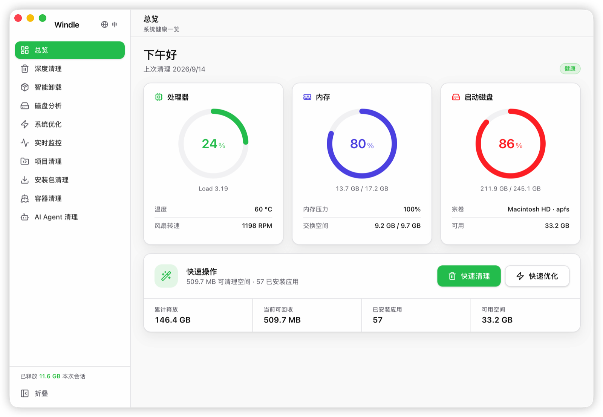<br><sub>仪表盘</sub></td>
    <td width="50%" align="center">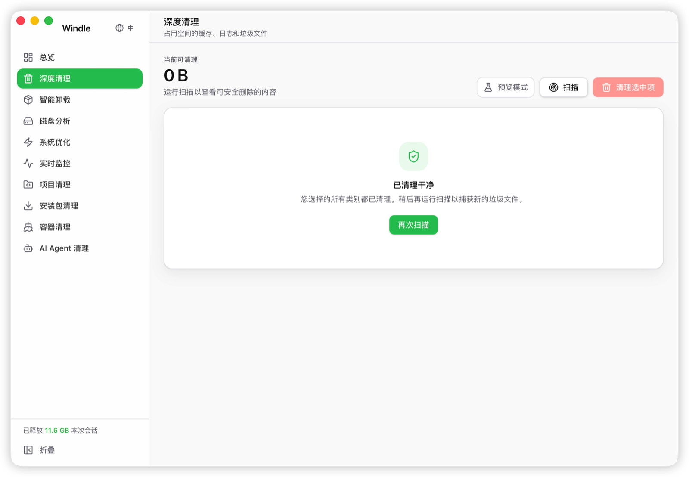<br><sub>深度清理</sub></td>
  </tr>
  <tr>
    <td width="50%" align="center">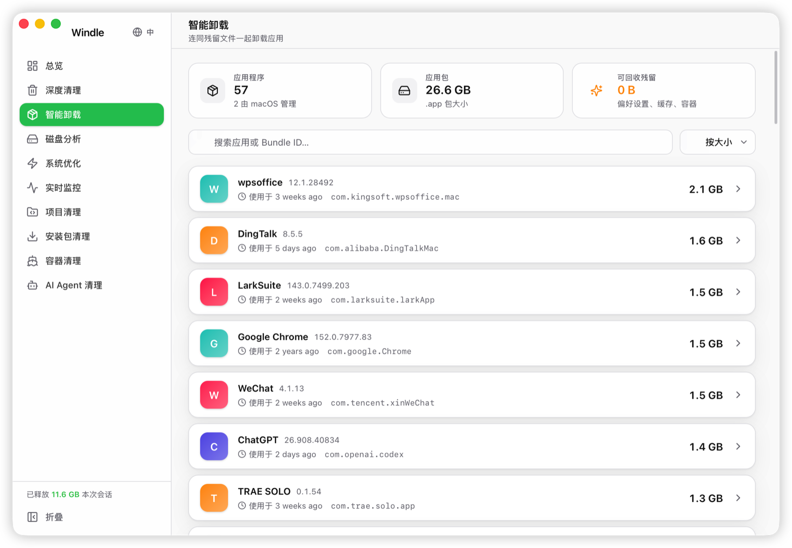<br><sub>智能卸载</sub></td>
    <td width="50%" align="center">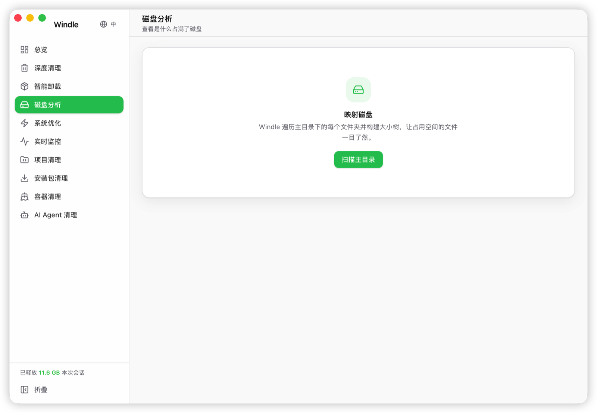<br><sub>磁盘分析</sub></td>
  </tr>
  <tr>
    <td width="50%" align="center">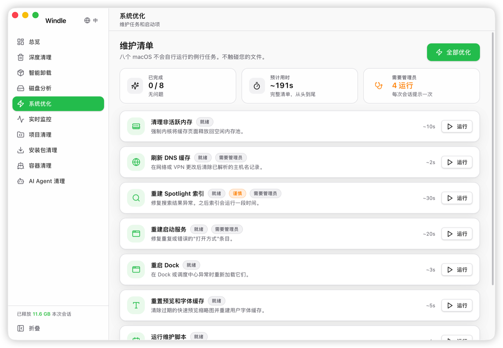<br><sub>系统优化</sub></td>
    <td width="50%" align="center">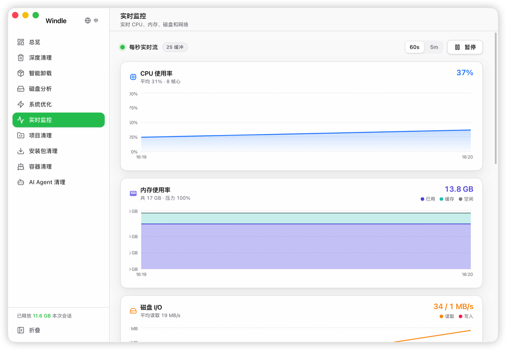<br><sub>实时监控</sub></td>
  </tr>
  <tr>
    <td width="50%" align="center">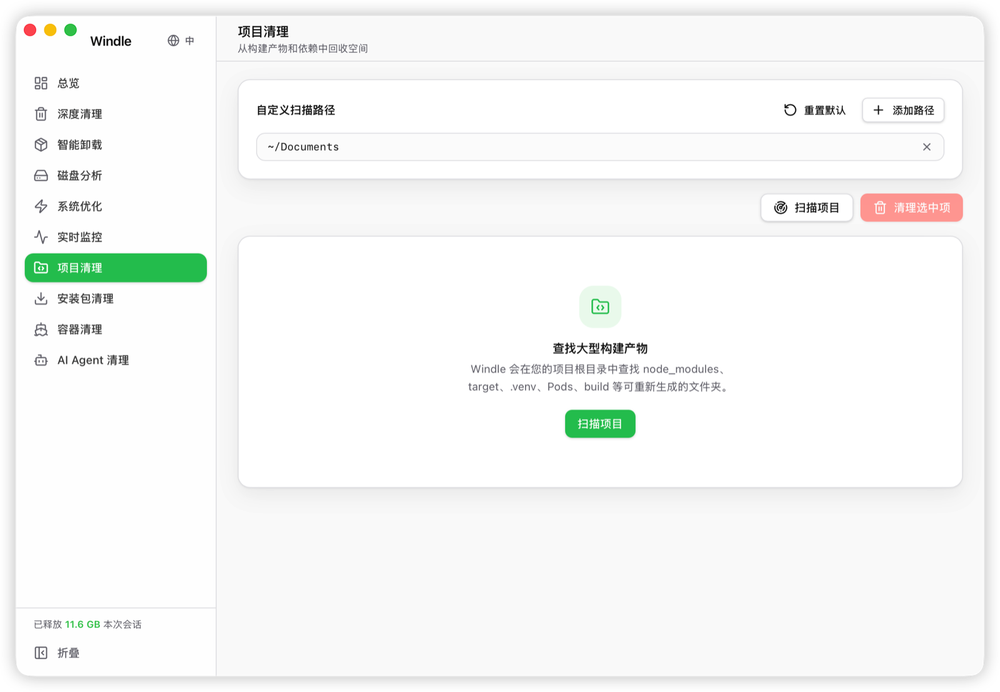<br><sub>项目清理</sub></td>
    <td width="50%" align="center">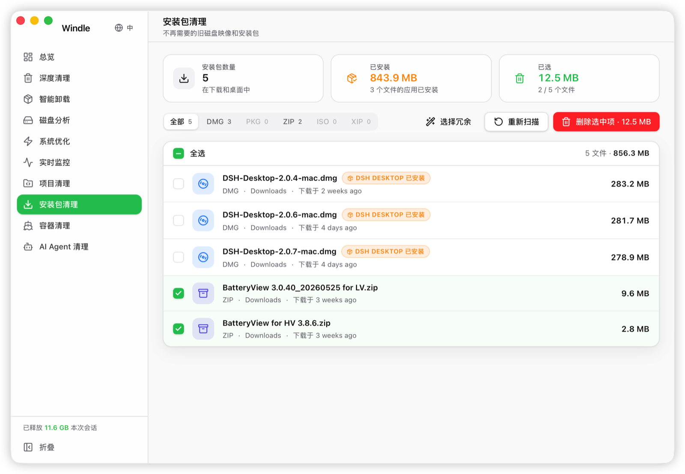<br><sub>安装包清理</sub></td>
  </tr>
  <tr>
    <td width="50%" align="center">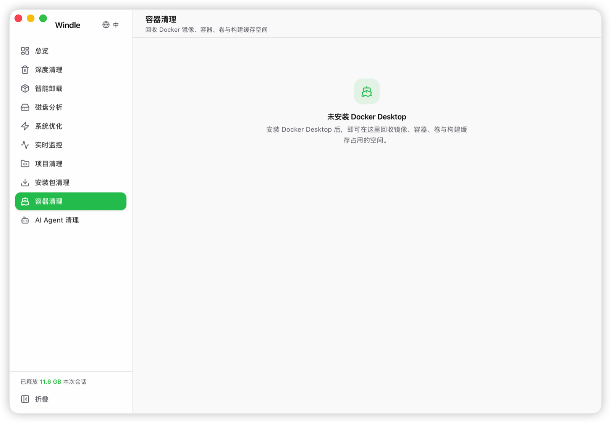<br><sub>容器清理</sub></td>
    <td width="50%" align="center">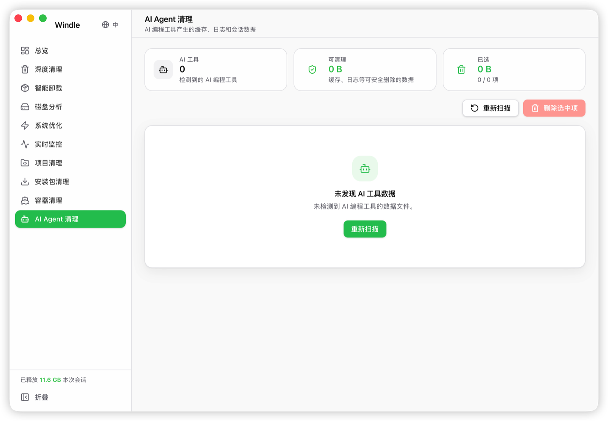<br><sub>AI Agent 清理</sub></td>
  </tr>
  <tr>
    <td width="50%" align="center">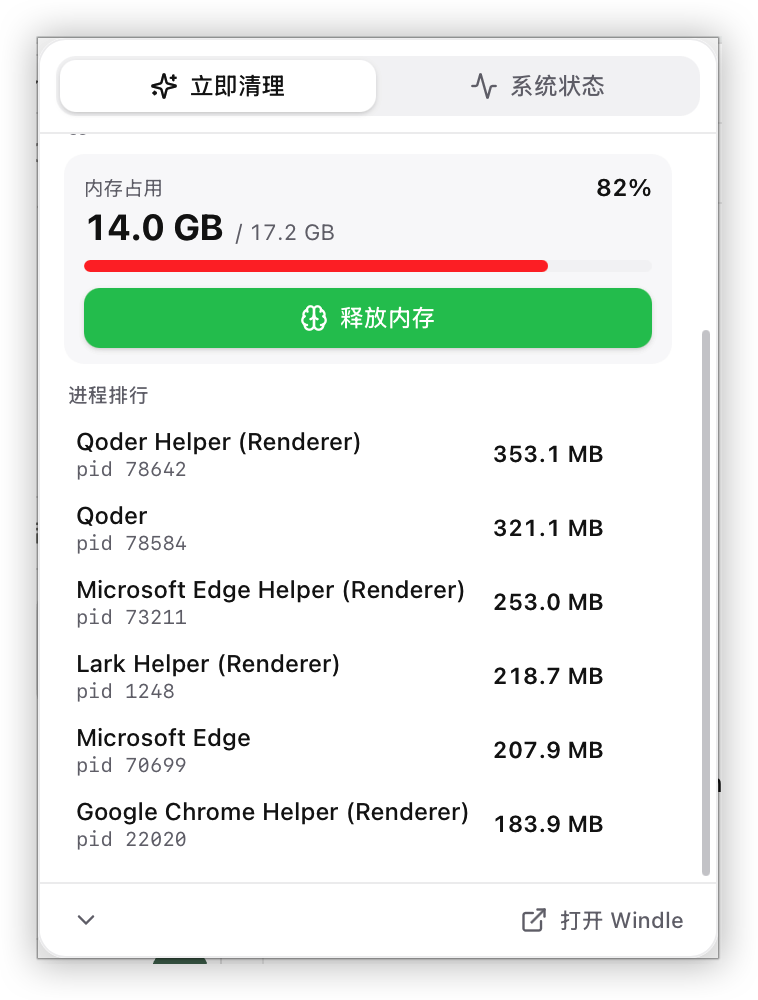<br><sub>菜单栏 · 立即清理</sub></td>
    <td width="50%" align="center">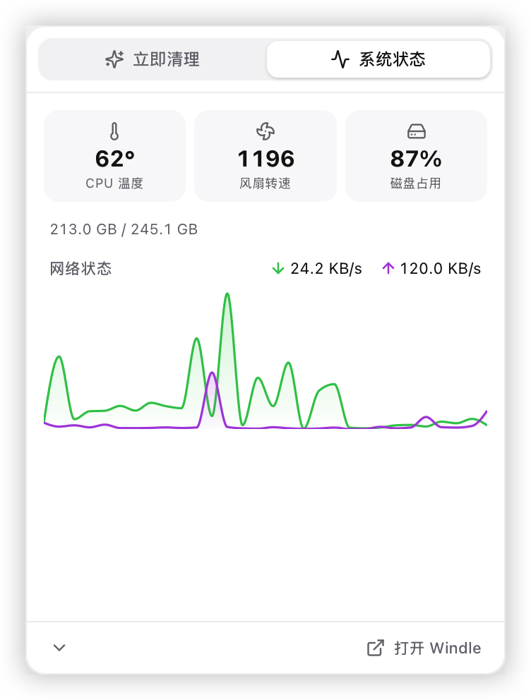<br><sub>菜单栏 · 系统状态</sub></td>
  </tr>
</table>

## 功能模块

| 模块 | 说明 |
| --- | --- |
| **仪表盘** | 磁盘概况、可回收空间估算、权限状态一览 |
| **深度清理** | 12 个清理分类，支持二级分组勾选与风险分级（safe / caution） |
| **智能卸载** | 卸载应用并扫描其残留文件（缓存、偏好设置、日志等） |
| **磁盘分析** | 可视化分析磁盘占用，定位大文件与目录 |
| **系统优化** | DNS 刷新、Spotlight 重建、内存回收等系统维护任务；管理员任务一次授权后批量执行 |
| **实时监控** | CPU、内存、磁盘、网络的实时状态与历史曲线 |
| **项目清理** | 清理开发项目的构建产物（`node_modules`、`target` 等） |
| **安装包清理** | 清理已无用的 `.dmg` / `.pkg` 安装包 |
| **Docker 清理** | 通过 Docker Engine API（unix socket）清理镜像、容器、卷与构建缓存，无需安装 docker CLI |
| **AI Agent 清理** | 清理 Trae、Qoder、Codex、Claude Code、Gemini CLI、DSH、Comate、OpenCode、CcSwitch、Openclaw、Yuanbao、Omega 等 AI 工具留下的缓存、日志、会话数据 |
| **菜单栏** | 常驻菜单栏的快速清理、系统状态与网络波形 |

### 深度清理分类

用户缓存、系统缓存、应用日志、应用垃圾、浏览器缓存、废纸篓、下载目录、邮件附件、Xcode DerivedData、iOS 备份、语言文件、失效符号链接。

其中应用日志覆盖 8 类来源，包括 `/Library/Logs`、`/private/var/log` 等系统运行时日志，以及 `/private/var/db/diagnostics` 下的诊断归档（Persist / Special / Signpost / HighVolume / timesync 等）与 `/Library/Logs/DiagnosticReports` 崩溃报告。

## 安全设计

删除操作全部经过后端白名单守卫（`ensure_removable`）：

- **前缀保护**：`/System`、`/usr`、`/private/var/db` 等 15 个敏感子树永远不可删除，只允许清空其中明确豁免的严格子路径（如 `/private/var/db/diagnostics`）
- **精确保护**：`~/Library`、`~/Desktop`、`/Applications` 等 32 个目录只允许清空内容、不允许整目录删除
- **符号链接解析**：删除前解析真实路径，防止链接指向受保护位置
- **风险分级**：每个条目标注 safe / caution，界面按风险分组展示与默认勾选
- **操作历史**：所有清理动作记录在本地历史中，可追溯

## 技术栈

- **前端**：React 18 · TypeScript · Vite 6 · Tailwind CSS v4 · Zustand · Recharts
- **后端**：Tauri v2 · Rust（sysinfo / walkdir / rayon / tokio）
- **打包**：Tauri Bundler（macOS `.app` / `.dmg`）

## 开发

环境要求：macOS、Node.js 20+、Rust 1.77.2+、Xcode Command Line Tools。

```bash
npm install          # 安装前端依赖
npm run tauri dev    # 启动开发模式（Vite + Tauri）
npm run typecheck    # TypeScript 类型检查
npm run tauri build  # 构建并打包 .app / .dmg
```

Rust 侧测试：

```bash
cd src-tauri
cargo test --lib     # 运行单元测试
cargo check          # 快速编译检查
```

构建产物位于 `src-tauri/target/release/bundle/`。

## 权限说明

- 部分清理目标（如 `/private/var/log`）受 macOS TCC 保护，需在 **系统设置 → 隐私与安全性 → 完全磁盘访问权限** 中授予 Windle 权限，否则这些路径将扫描不到内容
- 系统优化中的部分任务需要管理员密码，Windle 会一次性验证并在 15 分钟内复用，避免重复弹窗

## 目录结构

```
src/                 前端源码
├── components/      界面组件（features 各功能模块 / layout / menubar / ui）
├── services/        Tauri IPC 服务封装
├── stores/          Zustand 全局状态
├── i18n/            中英文文案
└── lib/             导航与工具函数
src-tauri/           Tauri / Rust 后端
├── src/commands/    命令层（clean / uninstall / analyze / optimize / docker …）
├── src/scanner/     文件系统扫描器
└── src/utils/       权限守卫、安全删除、历史记录
```

## 更新日志

见 [CHANGELOG.md](CHANGELOG.md)。

## 许可证

[MIT](LICENSE)
